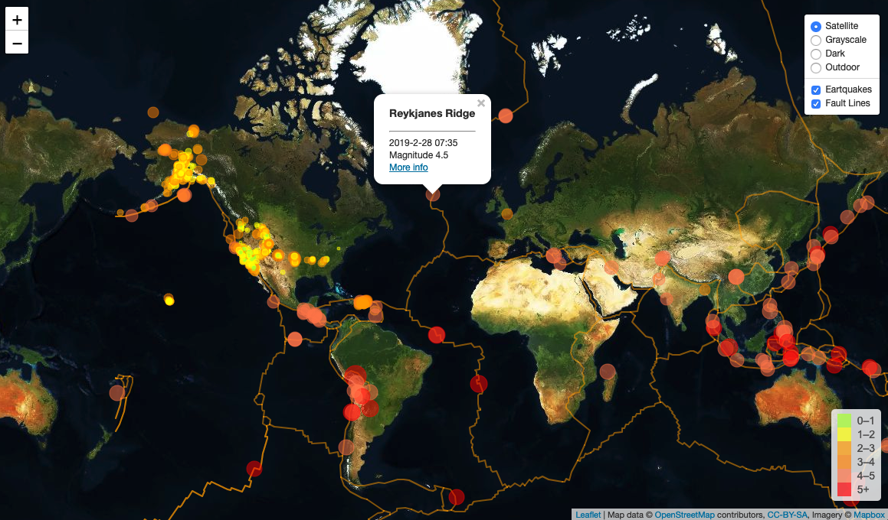
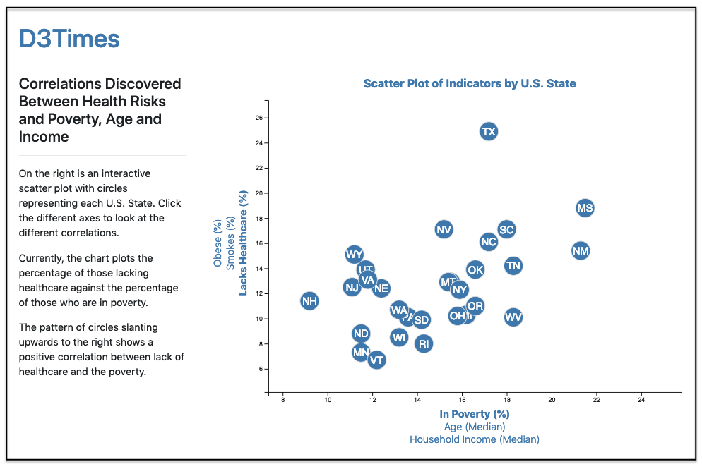
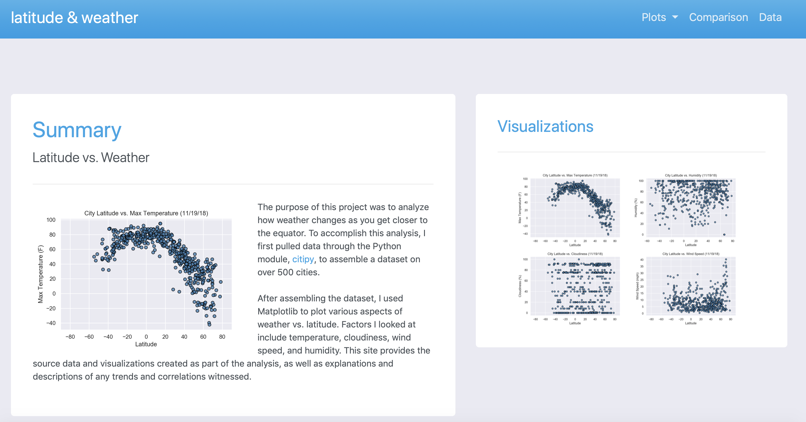
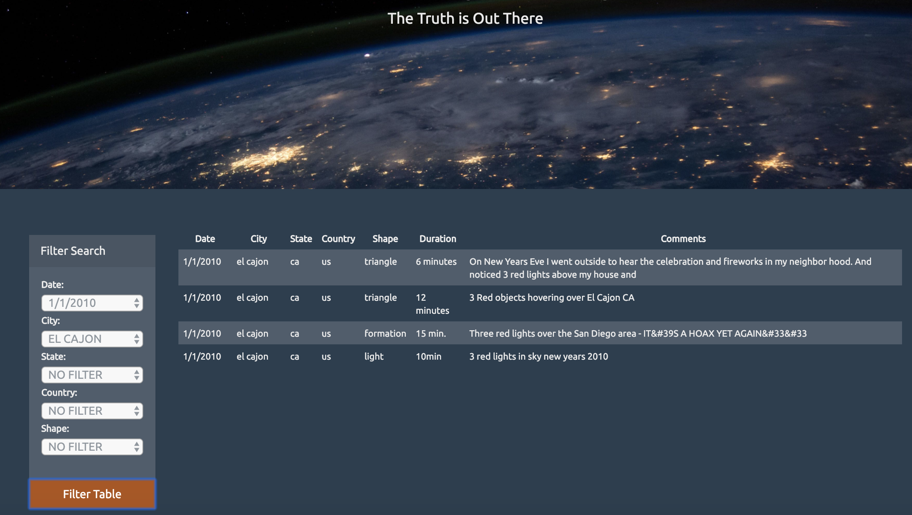
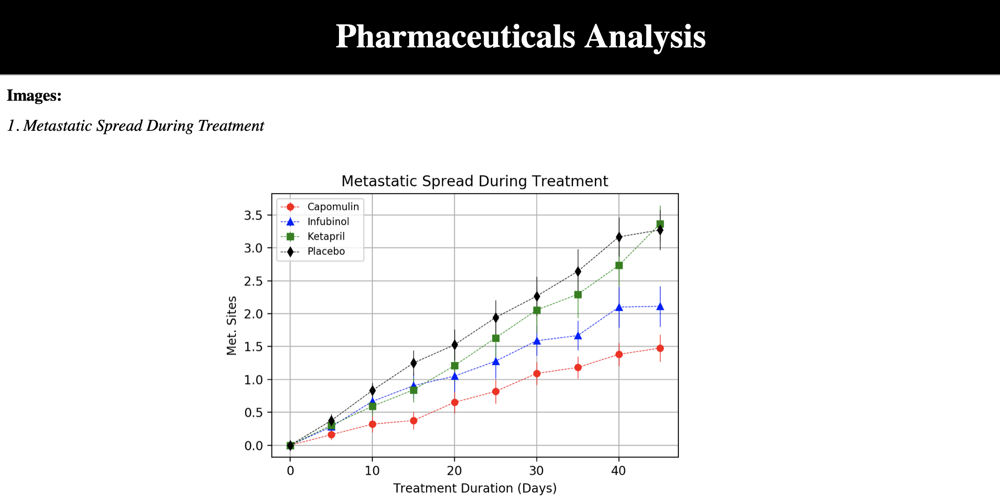

# minnawoo.github.io

## 1. Interactive Map of Seismic Activity
UofT SCS Data Analytics Bootcamp's Unit 17 Assignment 

### Completed Webpage

* https://minnawoo.github.io/interactive_map_of_seismic_activity/

 

## 2. Interactive D3 Chart
UofT SCS Data Analytics Bootcamp's Unit 16 Assignment 

### Completed Webpage

* https://minnawoo.github.io/interactive_d3_chart/

 

## 3. Web Visualization Dashboard
UofT SCS Data Analytics Bootcamp's Unit 11 Assignment 

### Completed Webpage

* https://minnawoo.github.io/latitude_vs_weather/index.html

 

## 4. JavaScript and DOM Manipulation
UofT SCS Data Analytics Bootcamp's Unit 14 Assignment 

### Completed Webpage

* https://minnawoo.github.io/UFOSightings/index.html

 

## 5. Python Plots
UofT SCS Data Analytics Bootcamp's Unit 6 Assignment 

### Completed Webpage

* https://minnawoo.github.io/pharmaceuticals/project_images.html

 
