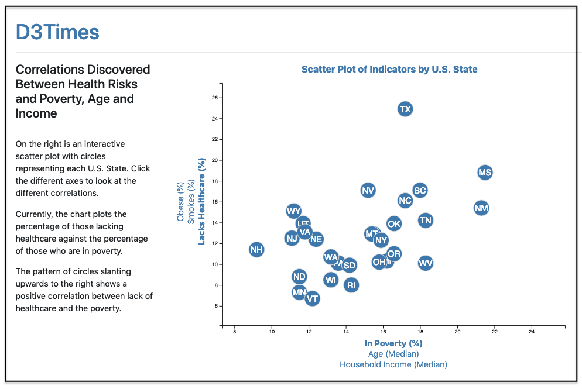

# interactive_D3_chart
UofT SCS Data Analytics Bootcamp's Unit 16 Assignment (D3)
 

<strong>Please view my completed interactive D3 chart at this link: 
  - [https://interactive-d3-chart.herokuapp.com/](https://interactive-d3-chart.herokuapp.com/)</strong>

## Background

The data set included with the assignment is based on 2014 ACS 1-year estimates: [https://factfinder.census.gov/faces/nav/jsf/pages/searchresults.xhtml](https://factfinder.census.gov/faces/nav/jsf/pages/searchresults.xhtml). The current data set includes data on rates of income, obesity, poverty, etc. by state. MOE stands for "margin of error."

### Level 1: D3 Dabbler

Create a scatter plot between two of the data variables `Healthcare vs. Poverty`.

Code this graphic in the `app.js` file and pull in the data from `data.csv` by using the `d3.csv` function.

* Include state abbreviations in the circles.

* Create and situate axes and labels to the left and bottom of the chart.

* Use `python -m http.server` to run the visualization. This will host the page at `localhost:8000`.

- - -

### Level 2: Impress the Boss (Optional Challenge Assignment)

Why make a static graphic when D3 lets you interact with your data?

#### 1. More Data, More Dynamics

Place additional labels in the scatter plot and give them click events so that users can decide which data to display. Animate the transitions for the circles' locations as well as the range of the axes. For an extreme challenge, create three for each axis.

#### 2. Incorporate d3-tip

Add tooltips to circles and display each tooltip with the data that the user has selected. Use the `d3-tip.js` plugin developed by [Justin Palmer](https://github.com/Caged).

## Copyright

Data Boot Camp © 2018. All Rights Reserved.
