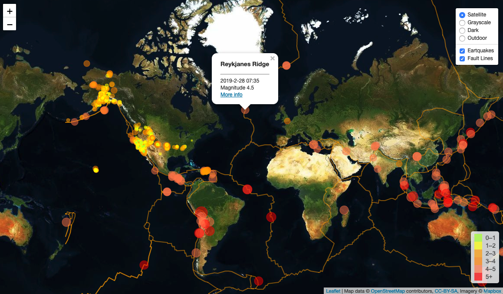

# interactive_map_of_seismic_activity
UofT SCS Data Analytics Bootcamp's Unit 17 Assignment (Geomapping with Leaflet.js)
 

<strong>Please view my completed interactive map at this link: 
  - [https://minnawoo.github.io/interactive_map_of_seismic_activity/](https://minnawoo.github.io/interactive_map_of_seismic_activity/)</strong>

### Level 1: Basic Visualization

Visualize an earthquake data set

1. **Get data set**

   

   The USGS provides earthquake data in a number of different formats, updated every 5 minutes ([USGS GeoJSON Feed](http://earthquake.usgs.gov/earthquakes/feed/v1.0/geojson.php)).

2. **Import & Visualize the Data**

   Create a map using Leaflet that plots all of the earthquakes from the past seven days.

   * Reflect the magnitude of the earthquake in marker size and color. Earthquakes with higher magnitudes appear larger and darker in color.

   * Include popups that provide additional information about the earthquake when a marker is clicked.

   * Create a legend for the marker colors.

- - -

### Level 2: More Data (Optional)

Pull in a second data set and visualize it along side the original set of data. Data on tectonic plates can be found at <https://github.com/fraxen/tectonicplates>.

Add a number of base maps to choose from as well as separate out earthquakes and fault lines so that they can be turned on and off independently.

## Copyright

Data Boot Camp (C) 2018. All Rights Reserved.
